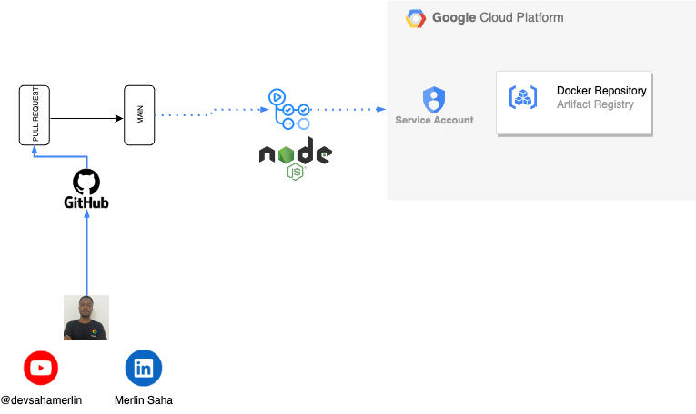

# Employee management api

## Code Structure


#### Dependencies


#### Index.js


#### Routes


#### Models


#### Controllers


#### Mongodb.js


#### Dockerfile
We are running Docker as non root user


#### Swagger.yaml


#### Tests
We are using Mocha, mocha-prepare and mongo-unit for IT Tests


## Deploy the Applications

## Deployment using Docker-compose

- For local deployment using docker compose, check this file: https://github.com/devsahamerlin/terraform-private-gke-mongodb-atlas/blob/main/LOCAL-DEPLOYMENT.md

## This below is Only for GCP CI Deployment using Artifact Registry




### Fork This Repo on your GitHub Account

### GitHub Actions Pipeline
- Feature Pipeline


- Pull Request Pipeline


- Main Pipeline


### Setup GCP and GitHub Actions

#### You can use our Youtube Video demo here:
#### Or follow manual step bellow

1. You must have GCP Project and Known your PROJECT_ID
2. Fork this repository on your own git account
3. Go to GCP `IAM & Admin`-> `Service Account`, then click on `github-actions-ar-sa@<PROJECT_ID>.iam.gserviceaccount.com` if you are using the IaC Terraform code provided or Create a service account `github-actions-ar-sa@<PROJECT_ID>.iam.gserviceaccount.com` with the following Rules: `roles/artifactregistry.writer`
4. Generate Key:
    - Click on the service account, in the Tab menu, click on `KEYS`, click on `ADD KEYS`, click on `Create New Key` and choose `JSON`, then click on `CREATE`

    * Select Service Account
   
      

    * Click on `Create New Key`
   
      

    * Click on `CREATE`
   
      


5. Add the content of your GCP Credentials file on GitHub Actions secret

- Google Cloud Recommend to Use `Workload Identity Provider` with GitHub Actions, you can get details here and how to use it https://cloud.google.com/blog/products/identity-security/enabling-keyless-authentication-from-github-actions. We added both options in GitHub Actions workflows, if you are using The Terraform provided code for your Infrastructure, then you can use it, by uncommenting `workload_identity_provider` step in `.github/worklows/main.yml line 37 to 42` and comment `line 32 to 35`

- On your project repository click on Settings -> Secrets & variables -> New Repository Secret and paste the Json content of your credentials file. give name as `GOOGLE_APPLICATION_CREDENTIALS` and click on Add secret

  

* Key content

  

- Repeat to add these Secrets to GitHub Actions:
```sh
    GCP_PROJECT_ID # your gcp project id
    GCP_PROJECT_NUMBER # (Optional)  If you choose to use Workload Identity Provider, your can you gcp project number directly on the GCP Welcom page when you select projet, is like this 123456789
```

- All Secrets Result

  

6. Make change on a feature branch, then create a Pull Request and Merge to `main` branch to start the pipeline. or directly push new change on `main` branch

7. If you follow all steps correctly, your image will be push on GCP Artifact Registry


## If you want to run the application

### Install dependenies
```sh
npm i
```

### Run test
```sh
npm run test
```

### Run the application
```sh
npm run dev
```